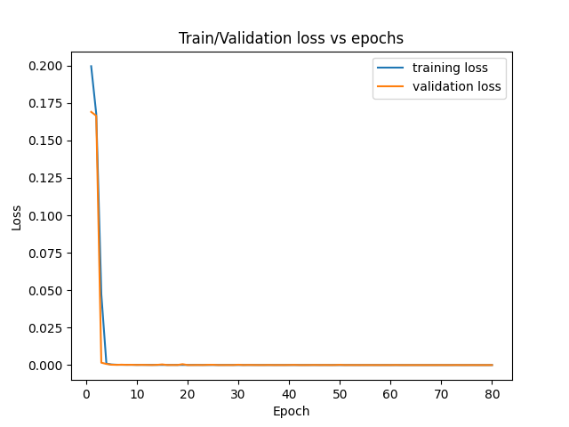
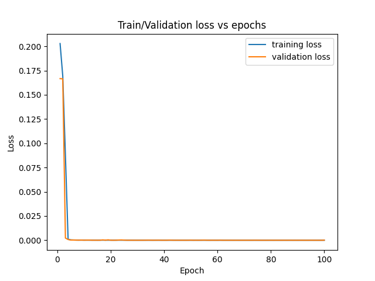
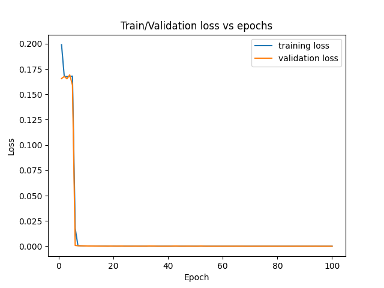
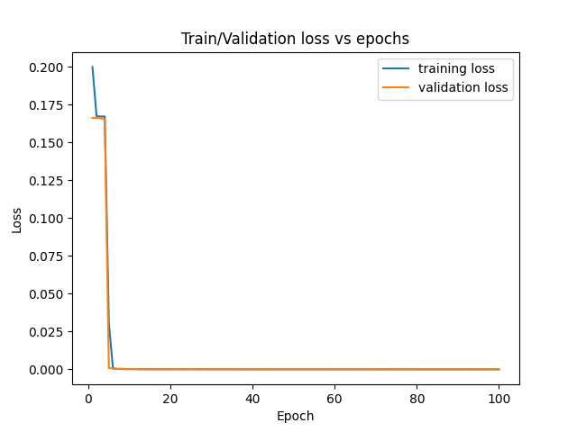
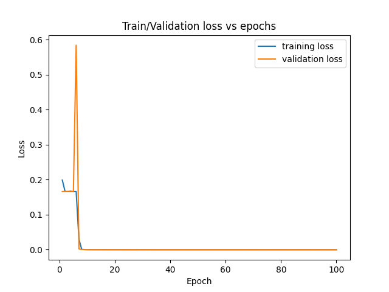
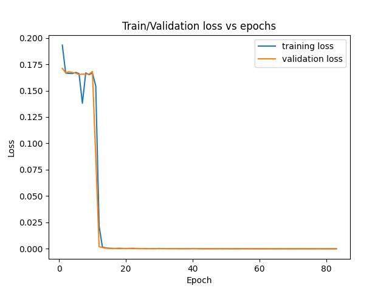
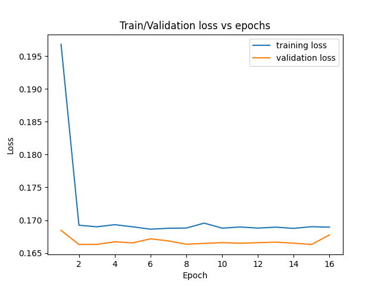
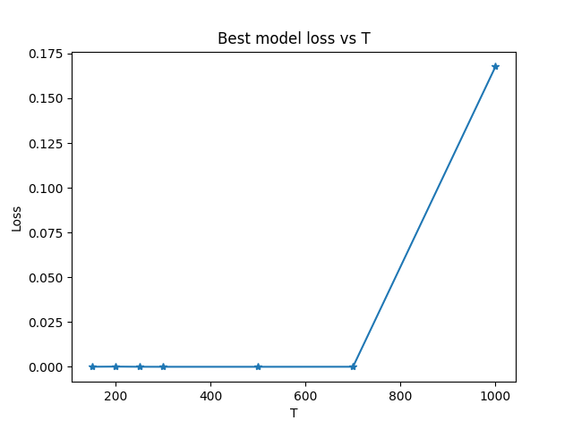

# A sequence model that learns to add to real numbers

This problem is described in detail in "Le et al (2015) - A Simple Way to 
Initialize Recurrent Networks of Rectified Linear Units", paragraph 4.1.

NB: Neither the initialization nor the model follows the paper.

## Model Description
For this problem an LSTM of 100 cells was used. The input to the model is (2,T) 
array where the first row is a series of numbers generated randomly by a uniform
distribution in the range [0,1), and the second row is a random mask that is 0 
at every time-step apart from two random instances when it is 1. The output of 
the final LSTM is fed into a Feed-forward layer of 1 unit and no activation. 
This servers only as a dimensionality reduction function.

## Installation
This folder contains a requirement.txt that will install all required python 
packages using
```
pip install -r requirements.txt
```

However, this was created using a Macbook M1 so a special version of Tensorflow 
was used to support that. If you are not using a similar hardware please delete 
all lines from requirements.txt that contain a tensorflow package and install 
tensorflow using
normal tensorflow using
```
pip install tensorflow
```

## Use
To use this project you need to  
1. Create a config file like the one in configs/config.yaml
2. Run main.py with the correct command line arguments:
```
python main.py --mode XXXX --config filepath
```

where XXXX should be replaced with either *train* or *validate* and the filepath 
should be replaced with the filepath of the *config.yaml* file.

### Config.yaml
dataset: (parameters to create the random dataset)  
&nbsp;&nbsp;&nbsp;&nbsp;dt_length: (dataset length)  
&nbsp;&nbsp;&nbsp;&nbsp;t: (sequence length)  
train: (parameters to train the model)  
&nbsp;&nbsp;&nbsp;&nbsp;epochs: (number of epochs)  
&nbsp;&nbsp;&nbsp;&nbsp;batch: (batch size)  
&nbsp;&nbsp;&nbsp;&nbsp;es_patience: (early stopping patience)  
artifacts: (filepath of the artifacts folder to be created)  

### Train mode

In train mode the model will be trained according to the dataset and the 
parameters specified in the config.yaml. The created artifacts are:  
1. a copy of the config file to be used as reference for each experiment
2. a loss pickle file containing the train (loss) and validation loss (val_loss)
3. a model folder with the trained tf model

### Validation mode

In validation mode the model is called from the artifacts folder and validated 
against a newly generated dataset (different seed than the one used during 
training). This dataset along with the model's prediction (*y_hat*) is saved in 
a pred.pkl file. 

## Results

The model was used on sequences of T = 150,200,250,300,500,700 and 1000. The 
dataset length was 100,000 sequences on all cases. Below we show the Training/Validation
Loss against the epoch for each experiment. From these we draw the following conclusions:

1. For T less than 700 the validation loss decreases along with the training loss. 
Hence the model does not overfit.
2. For T = 1000 the model fails to decrease its validation loss, meaning that it 
cannot complete its objective and it terminates due to early stopping on its 
17th epoch.
3. As T increases the convergence speed of the model also increases prooving 
that the task becomes more difficult. This is in agrrement both with the author 
of the original paper and our intuition.

### Experiment on T = 150



### Experiment on T = 200



### Experiment on T = 250



### Experiment on T = 300



### Experiment on T = 500



### Experiment on T = 700



### Experiment on T = 1000



### Comparison of best loss for each experiment




